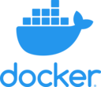

<h1 align="center">Python app boilerplate

</h1>

## Introduction

This repository aims to facilitate the creation of a python service.

It uses python3.9 as a base.

It is dockerized, with a minimal base image to reduce its size to the vital minimum.

## Features

- Easy to develop on with development helpers:

  - `pylint`: to help you write pythonic code.
  - `yapf`: to help you format your code.
  - `mypy`: to help you write python code with typings.

- Easy to test with the help of some tools:

  - `pytest`: to test your app with unit tests.
  - `pytest-cov`: to check your tests coverage.

- Easy to deploy with the help of docker.

## Development

In order to develop you service in optimal conditions (linting, autocomplete, etc),
you need to setup a virtual environment and install all the packages you need:

- Run `./scripts/setup.sh` to create the virtual environment and install packages
- In your shell, activate the virtual env: `source .virtualenv/bin/activate`

If you're using `vscode`, a setting file is provided to use the virtual environment.

You need to install the official Python extension to get the best of your IDE.

### Run the app locally

Run `python src/main.py` in your shell with activated virtual environment.

### Run tests locally

Run `python -m pytest --cov=src --cov-config=tests/.coveragerc tests`

## Docker image

The provided Dockerfile aims to facilitate the deployment of your application with docker.

It contains two stages:

- `app`: contains the package the app needs to run.
- `tests`: based on `app`, contains also the tests packages and sources, to let your run unit tests inside the container.

### Build the app

Run `docker build --tag=<YOUR_IMAGE_NAME:TAG> --target=app .`

### Build with tests

Run `docker build --tag=<YOUR_IMAGE_WITH_TESTS_NAME:TAG> --target=tests .`

## Github Actions

Under construction ...
